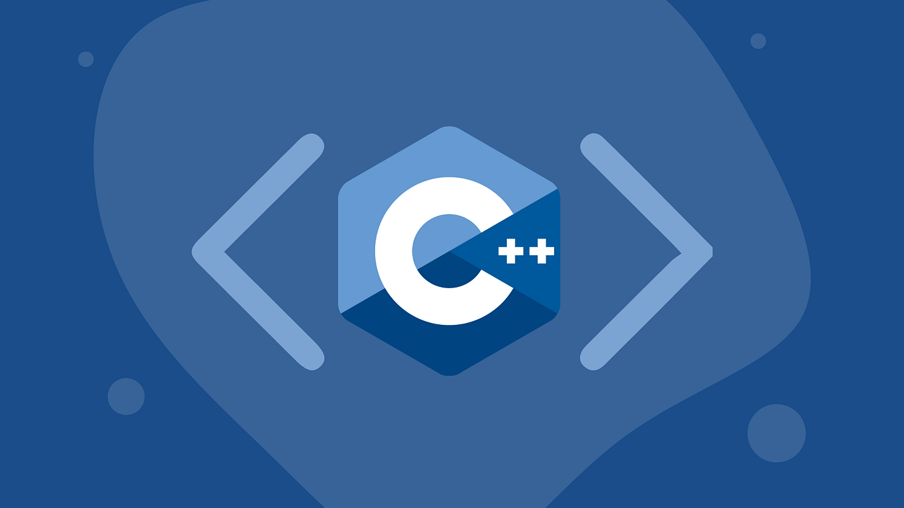

<h1 align="center">Hi 👋, I'm Abdul Munnam</h1>
<h3 align="center">A passionate frontend developer from Pakistan</h3>

  

- 📫 How to reach me **createrking40@gmail.com**

<h2><i>💻 Tech Tools </i></h2>

<table width="100">
<tr>
    <td align='center' width="190">
        
    </td>
    <td align='center' width="190">
        
    </td>
    <td align='center'>
        
    </td>
     <td align='center' width="190">
        
    </td>
    <td align='center'>
        
    </td>
</tr>
<tr>
    <td align='center'>
        
    </td>
    <td align='center'>
        
    </td>
    <td align='center'>
        
    </td>
    <td align='center'>
        
    </td>
    <td align='center'>
        
    </td>
</tr>
<tr>
    <td align='center'>
        
    </td>
    <td align='center' width="190">
        
    </td>
    <td align='center'>
        
    </td>
     <td align='center'>
        
    </td>
</tr>

</table>

 
 

## Connect with Me 🤝

 <h2><i>⚙️ GitHub Analytics </i></h2>

  

